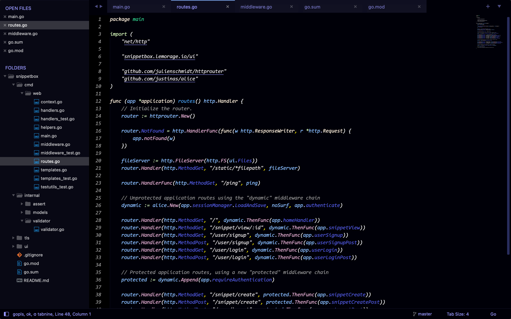
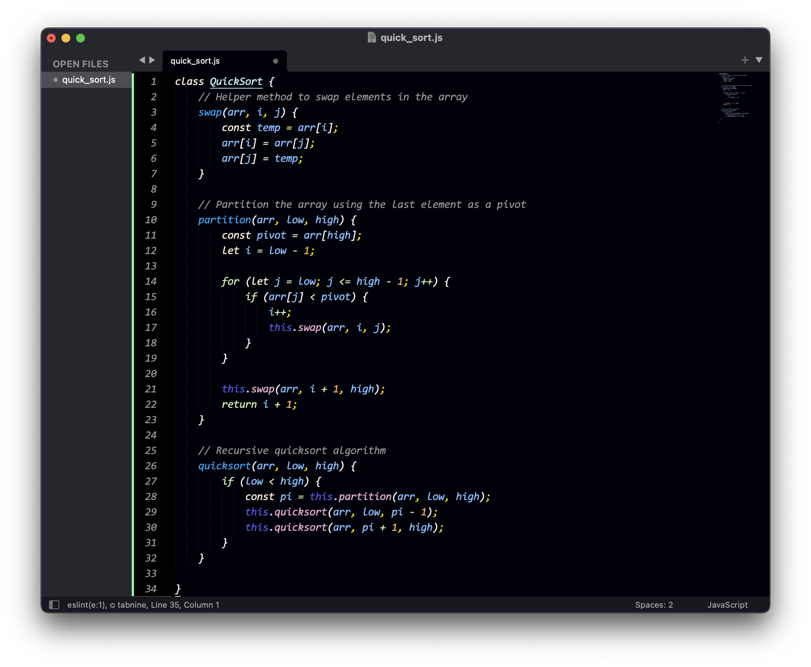
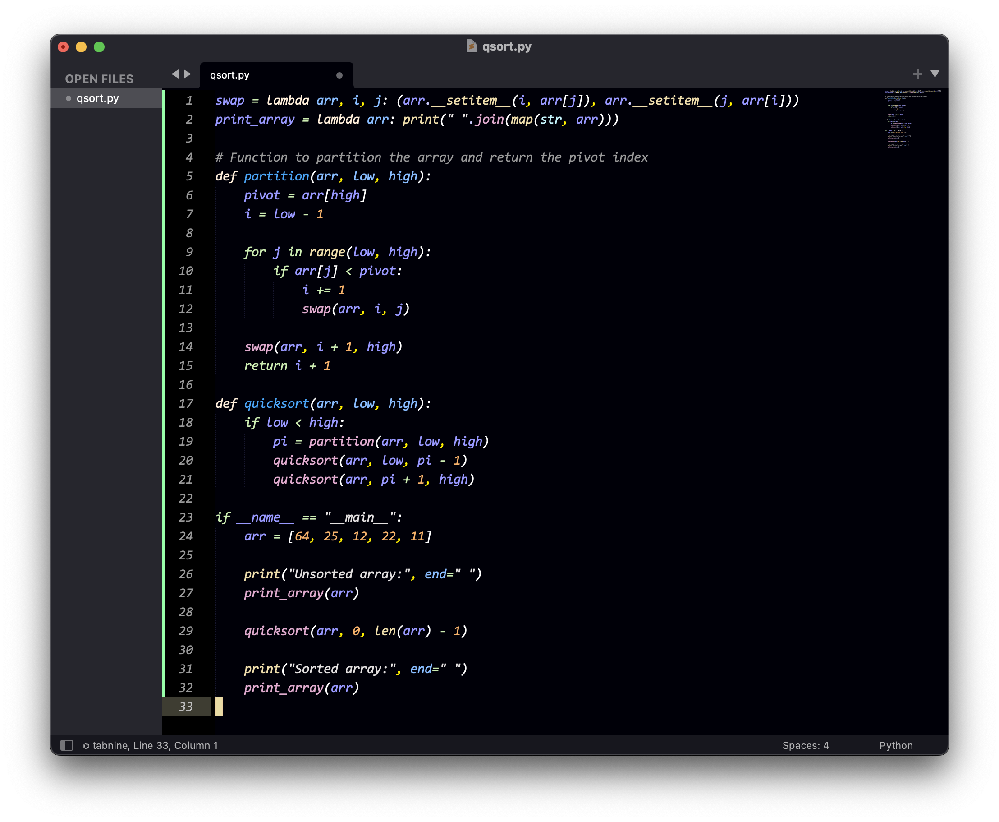
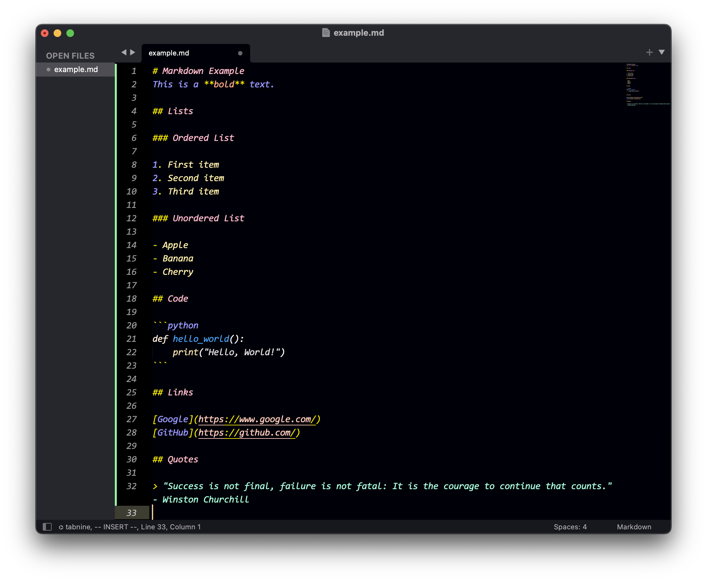

# Sublime-Clannad-Theme
> Hey! 🌈 Meet the Clannad Theme for [Sublime Text 4](http://sublimetext.com) – cozy coding with a dash of tranquility from the beloved anime series. Let's make coding as chill as a lazy Sunday afternoon! 😎✨

## Why Clannad Theme?

- Choosing a color scheme for your coding environment is a personal decision, and this theme offers a unique twist, a refreshing alternative for those who want their coding environment to reflect their personal style.
- We believe in keeping it simple yet classy. The theme focuses on simplicity and elegance, making your code not only easy to read but also a delight for the eyes.
- It's not just about looks; It all comes down to a smooth transition between style and utility. The Clannad Theme ensures that your coding experience is not only visually pleasing but also practical and efficient.

## Preview

### Clannad Theme

  
  
  
  
  

 

### Only Clannad Color Scheme (under the default Adaptive Theme)

 
  
  
  
  
  
  
  
  
  

## Installation
1. **Locate Sublime Text Packages Directory:**
    - Open Sublime Text.
    - Click on `Preferences` -> `Browse Packages...`.

2. **Download the Clannad Theme Package:**
    - Visit the [releases page](https://github.com/lemorage/sublime-clannad-theme/releases).
    - Download the latest release of the `Clannad Theme` asset.

3. **Install the Theme:**
    - Move the downloaded package into the Sublime Text Packages directory.

4. **Apply the Theme or Color Scheme:**
    1. Theme
        -   Go to `Preferences` -> `Select Theme...` or Go to `Tools` -> `Command Palette` -> `UI: Select Theme`
        -   Choose the *Clannad Theme* from the available options.
    2. Color Scheme
        -   Go to `Preferences` -> `Select Color Scheme...` or Go to `Tools` -> `Command Palette` -> `UI: Select Color Scheme`
        -   Choose the *Clannad Color Scheme* from the available options.
        -   Additionally, you might notice there is also a slightly older color scheme `ClannadLegacy`, which is available for your use. However, please be aware that this color scheme may not receive frequent updates and is maintained for legacy purposes.

5. **Enjoy a Pleasing Coding Experience!**

## Contributing

Your contributions and suggestions are welcome! If you encounter any issues or have ideas for improvements, please [open an issue](https://github.com/lemorage/sublime-clannad-theme/issues) or submit a pull request. Your feedback helps make this color scheme better for the community.

## License
[BSD-2-Clause License](./LICENSE) © 2023 Clannad Theme
